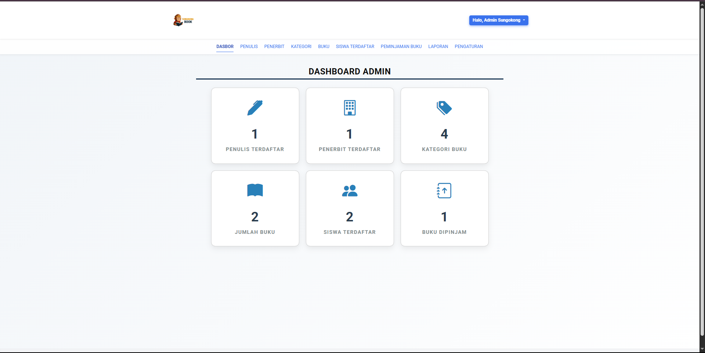
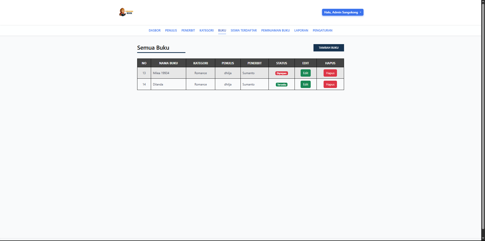
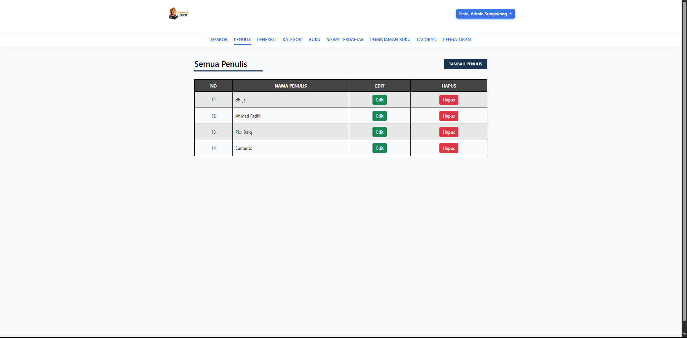
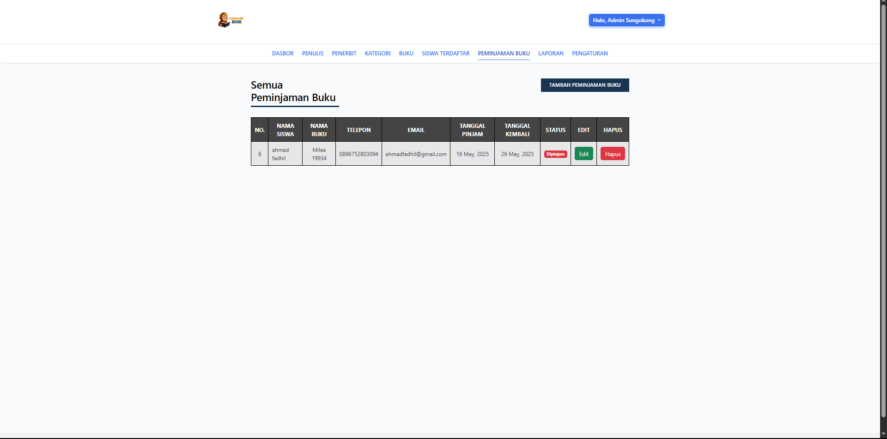
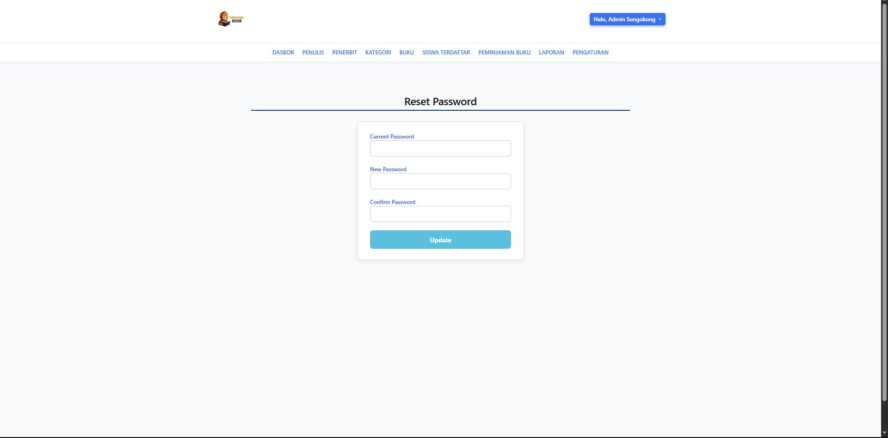
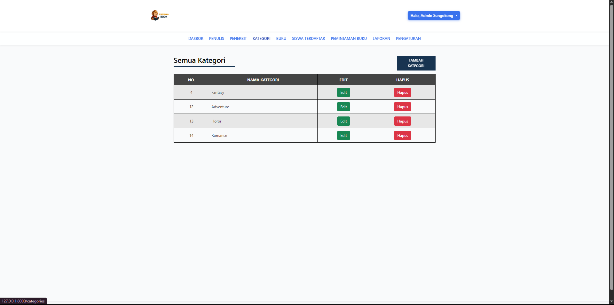
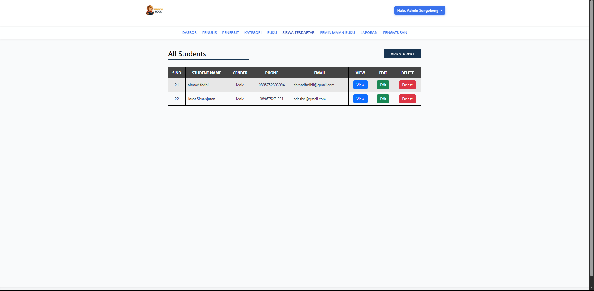
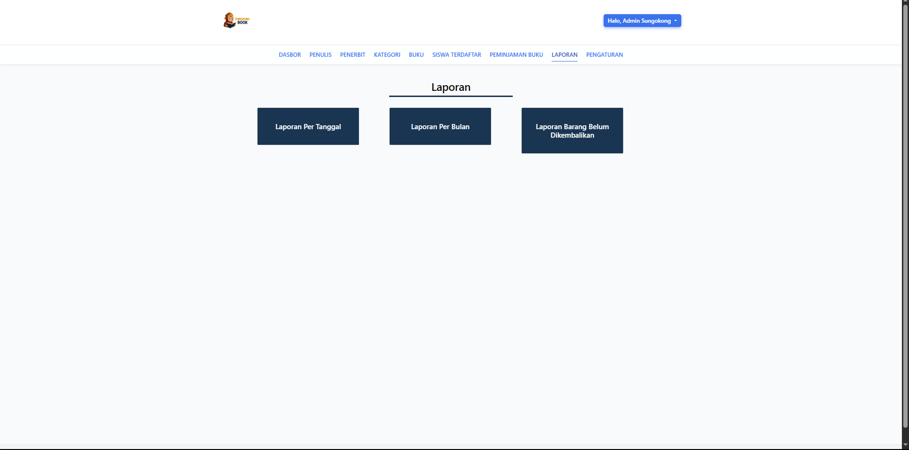
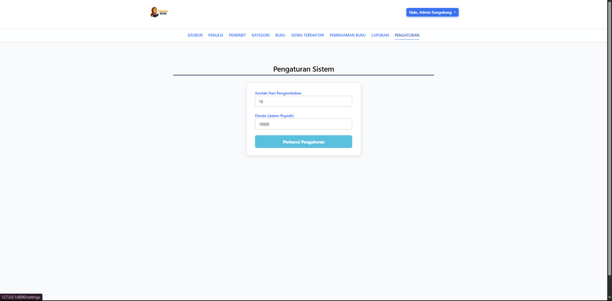

<p align="center"><a href="https://laravel.com" target="_blank"></a></p>

# Laravel Library Management System


markdown
# 📚 SystemManagementLibrary_Laravel

Manajemen perpustakaan berbasis web dibangun dengan **Laravel 10**, men-cover siklus penuh pengelolaan buku, penulis, penerbit, kategori, peminjaman, dan laporan. Cocok untuk sekolah, kampus, maupun perpustakaan umum skala kecil–menengah.

---

## ✨ Fitur Utama
| Modul | Fitur Detail |
|-------|--------------|
| **Autentikasi** | Login, logout, ganti password |
| **Dashboard** | Ringkasan statistik koleksi & peminjaman |
| **Penulis** | CRUD data penulis |
| **Penerbit** | CRUD data penerbit |
| **Kategori** | CRUD kategori buku |
| **Buku** | CRUD buku lengkap dengan cover & stok |
| **Siswa/Anggota** | CRUD data anggota / siswa |
| **Peminjaman** | Peminjaman, pengembalian, denda terlambat |
| **Laporan** | Laporan tanggal, bulanan, buku belum kembali |
| **Pengaturan** | Profil perpustakaan, logo, info kontak |

> **Catatan:** Semua rute dilindungi middleware `auth` kecuali halaman login.

---

## 🛠️ Tech Stack
- **PHP 8.2** & **Laravel 10**
- **MySQL/MariaDB**
- **Blade** + TailwindCSS
- **JavaScript (Vite + Vue optional)**
- **Composer** & **NPM** untuk manajemen paket

---

## 🚀 Instalasi Cepat


# 1. Clone repo
```bash
git clone https://github.com/dhiljaa/SystemManagementLibrary_Laravel.git
cd SystemManagementLibrary_Laravel
```

# 2. Instal dependensi backend
```bash
composer install
```
# 3. Instal & build asset frontend
```bash
npm install
npm run dev            # atau npm run build untuk production
```
# 4. Salin env & generate key
```bash
cp .env.example .env   # Windows: copy .env.example .env
php artisan key:generate
```
# 5. Atur koneksi database di .env lalu migrate + seed demo data
```bash
php artisan migrate:fresh --seed
```
# 6. Jalankan server lokal
```bash
php artisan serve
````

### 🔑 Kredensial Demo

| Role       | Username       | Password   |
| ---------- | -------------- | ---------- |
| Admin Demo | `tauseedzaman` | `password` |

---

## 🗺️ Ringkasan Rute Web

Rute publik:

| Method | URI | Controller              | Middleware |
| ------ | --- | ----------------------- | ---------- |
| GET    | /   | `welcome` view          | guest      |
| POST   | /   | `LoginController@login` | guest      |

Rute terotentikasi (ringkasan):

* `/dashboard` – Dashboard utama
* `/authors`, `/publishers`, `/categories`, `/books`, `/students` – CRUD modul
* `/book_issue` – Peminjaman buku
* `/reports/*` – Laporan (tanggal, bulanan, belum kembali)
* `/settings` – Pengaturan profil

---

## 📸 Cuplikan Layar

## Screenshots

### Dashboard


### Login


### Buku


### Penulis


### Peminjaman


### Reset Password


### Kategori


### Penerbit


### Siswa Terdaftar


### Laporan


### Pengaturan



---

## 🤝 Kontribusi

1. Fork repo & buat branch fitur:

   ```bash
   git checkout -b fitur/fitur-baru
   ```
2. Commit perubahan (sertakan deskripsi jelas).
3. Push ke branch:

   ```bash
   git push origin fitur/fitur-baru
   ```
4. Buka Pull Request.

---

## 📝 Lisensi

Proyek ini dilisensikan di bawah **MIT License** — silakan lihat file `LICENSE` untuk detail.

---

> Dibuat dengan ❤ oleh \[Sungokong Company] — Selamat berkarya dan semoga bermanfaat!


### Cara pakai
1. **Buat atau timpa** file `README.md` di root repositori.
2. Commit & push:
   ```bash
   git add README.md
   git commit -m "docs: tambah README lengkap"
   git push
````

